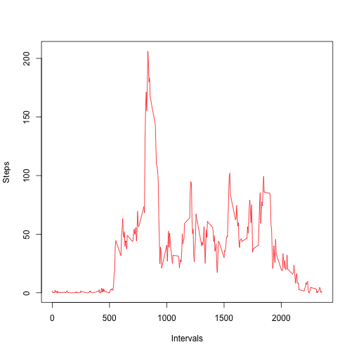
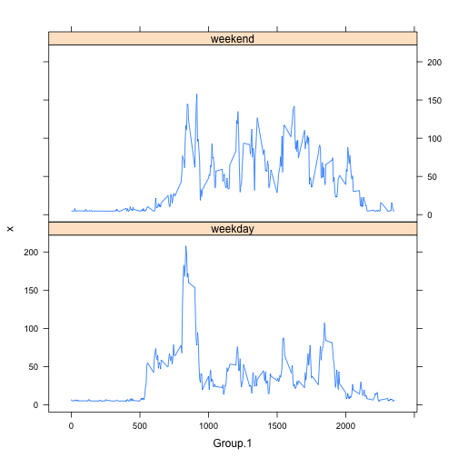

Reproducible Research Peer Assessment 1 - Alia Hameed
=====================================================

### Loading and Preprocessing ###
Assuming that the Activity Monitoring Data has been downloaded and unzipped to the current working directory, the file is read into the **activity** object, with the format specified for each column.


```r
activity <- read.csv("activity.csv", colClasses = c("numeric", "Date", "numeric"))
```


### Mean Total Number of Steps Taken Per Day ###
For this part of the assignment, I first aggregate steps taken by date (summing over all intervals in each day), and display the results in a histogram showing the total number of steps taken each day.  

```r
aggdata <- aggregate(activity$steps, by = list(activity$date), FUN = sum, na.rm = TRUE)
hist(aggdata$x, main = "Total Number of Steps Per Day", xlab = "Steps")
```

 

The **mean** total number of steps taken per day = *mean(aggdata$x)* = **9354**

The **median** total number of steps taken per day = *median(aggdata$x)* = **10395**

### Average Daily Activity Pattern ###
The average daily pattern can be established by taking the aggregate of the mean number of steps taken in each interval. The results are displayed in a time series plot.

```r
aggdata2 <- aggregate(activity$steps, by = list(activity$interval), FUN = mean, 
    na.rm = TRUE)
plot(aggdata2$Group.1, aggdata2$x, xlab = "Intervals", ylab = "Steps", type = "l", 
    col = "red")
```

 


This allows me to identify the 5-minute interval which contains, on average, the maximum number of steps.

```r
maxrow = subset(aggdata2[aggdata2$x == max(aggdata2$x), ])
maxinterval <- as.numeric(maxrow[1])
```

Interval with the maximum number of steps = **835**

### Imputing Missing Values ###
The number of rows containing missing values can be calculated using the **complete.cases** function.


```r
ok <- complete.cases(activity)
```

Number of rows with missing values = *sum(!ok)* = **2304**

My strategy for filling in these values was to use the mean for a particular interval. I chose not to differentiate between weekends and weekdays, for the sake of simplicity, and because there was no reason, at this point, to suspect a difference between the two. (Also, without knowing where this data was collected, one cannot assume that the weekend corresponds to Saturday and Sunday!) 

```r
for (i in which(sapply(activity, is.numeric))) {
    activity[is.na(activity[, i]), i] <- mean(activity[, i], na.rm = TRUE)
}
aggdata3 <- aggregate(activity$steps, by = list(activity$date), FUN = sum)
```


The histogram below shows that the distribution is slightly different with the missing values filled in. This is held up by the new **mean** and **median** values also, which are, as expected, slightly higher now that missing values have been filled in. 

```r
hist(aggdata3$x, main = "Total Number of Steps Per Day", xlab = "Steps")
```

 

The **mean** total number of steps taken per day = mean(aggdata3$x) = **10766**

The **median** total number of steps taken per day = median(aggdata3$x) = **10766**

### Differences Between Weekdays and Weekends ###
As suggested, I used the **weekdays()** function to create a factor variable in the dataset with two levels - "weekday" and "weekend" indicating whether a given date is a weekday or a weekend day.

```r
activity$weektime <- as.factor(ifelse(weekdays(activity$date) %in% c("Saturday", 
    "Sunday"), "weekend", "weekday"))
```


I then aggregate the mean number of steps by interval and "weektime" (i.e. whether the date is a weekday or weekend day). This gives me 576 results (288 weekday intervals plus 288 weekend intervals), which I can then display in panel plots using the lattice system. One can see quite clearly a difference between weekday and weekend activity.

```r
aggdata4 <- aggregate(activity$steps, by = list(activity$interval, activity$weektime), 
    FUN = mean)
library(lattice)
xyplot(x ~ Group.1 | Group.2, data = aggdata4, layout = c(1, 2), type = "l")
```

 


That's all for now, folks! :)
